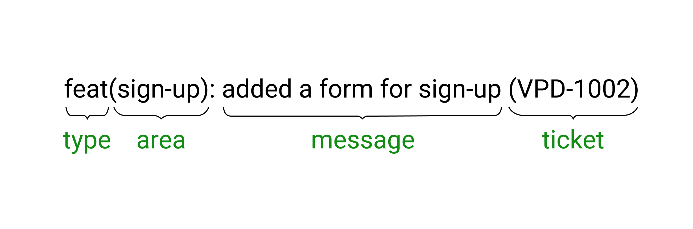

# Rules for naming branches, commits, and pull requests

## 1. Motivation

A properly named branch or commit gives the maximum amount of information per unit of time. We work with people and almost any contribution you make to the project will later be used by your colleague or client. It is important that everyone understands each other quickly and without problems, so we defined some standards and extended them to all our projects.

## 2. Branch naming rules

2.1. The stable branch is `main` (new repositories) or `master` (old repositories). This branch should contain the latest stable version of the codebase.

> _What's the point?_ Imagine that your servers had a serious failure and you need to restore everything "as it was" as soon as possible. In this situation, the stable branch comes to the rescue - the changes in it have been tested and, as we know, workable. You take the code from this branch, data from backups, deploy, and - voila!

2.2. The development branch is `develop`. This branch should contain all the new changes that have already been reviewed but have not yet got to production.

> _What's the point?_ We separate tested and guaranteed working features from new functionality that may contain bugs.

2.3. Release branches are `release/{номер релиза}`. If you need to make a release, fork from the `develop` branch and thoroughly test the functionality in the resulting release branch (or push the branch to the tester if he/she is attached to the project). If you find problems or regressions, bring back the code for revision. If no problems are found, make a Pull Request from the release branch to `master`.

2.4. Branches for new functionality are `{type}/{ticket}` or `{type}/{description}`. If you need to perform a task, create a new branch by forking off from the `develop` branch. When finished, create a Pull Request back to the `develop` branch.

**type** - the type of change the branch is carrying. There are the following types:

- **feat** - from the word feature. The branch contains new functionality
- **fix** - the branch does not add new functionality but fixes something in the existing code
- **chore** - code maintenance. For example, changing the webpack configuration or typescript
- **refactor** - the code does not introduce new functionality or fix anything, but changes the architecture or improves performance

**ticket** - Task ID in the task tracker or, if the task does not have a number, then **description** is a short description (literally in two or three words) of what the branch does (for example: `add_site_footer`).

> **Important.** We never commit directly to the `master` and` develop` branches - any changes in these branches must be reviewed by at least one team member.

> **Also important.** We follow the rule: `One task === one branch`. You shouldn't try to push changes related to several tasks into the same branch - you are most likely to be asked to redo such a branch.

## 3. Commit naming rules

**type** - commit type. The types are the same as in the branch naming rules

**area** - area of change. This is usually a page or block

**message** - commit description. Briefly expresses the essence of the change - a new feature or a description of a fixed problem

**ticket** - this is an optional part. There may not be a ticket, but if you specify, then this is the task ID in the task tracker

## 4. Pull request naming rules

4.1. Try not to make too large PRs - ideally, the PR size should not exceed 500 - 700 lines. Of course, in real development, there are situations when it is necessary to make an extra-large PR, but most often a large task can be split into several smaller ones.

4.2. The name of the PR is formed by the mask: `[{ticket}]: {Название задачи}`.

4.2. Every PR should have reviewers - don't forget to assign them.

## 5. Review rules

Once you've opened the Pull Request, one of the senior developers should look at it.

Sometimes changes in the code do not raise questions, but it also happens that the reviewer asks clarifying questions or asks to make changes to the code. In this case, it is reasonable to make the requested changes to the PR as quickly as possible, so that the feature gets to `develop` faster and there are no conflicts with the code of other team members.
