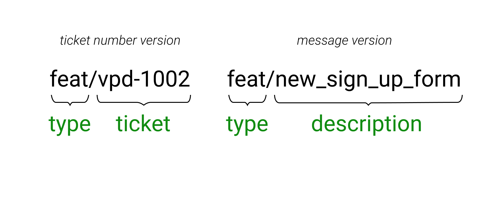

# Правила именования веток, коммитов и pull request'ов

## 1. Мотивация

Правильная названая ветка или коммит дает максимальное количество информации за единицу времени. Мы работает с людьми и почти любой ваш вклад в проект будет позднее использован вашим коллегой или клиентом. Важно, чтобы все быстро и без проблем понимали друг друга, поэтому мы определили некоторые стандарты и распространили их на все наши проекты.

## 2. Правила именования веток

2.1. Стабильная ветка - `main` (новые репозитории) или `master` (старые репозитории). Эта ветка должна содержать последнюю стабильную версию кодовой базы.

> _Зачем это нужно?_ Представьте, что на ваших серверах произошел серьезный сбой и вам нужно в максимально короткие сроки восстановить все "как было". В этой ситуации на помощь приходит стабильная ветка - изменения в ней протестированы и, как нам известно, работоспособны. Вы берете код из этой ветки, данные из бэкапов, деплоите и - вуаля!

2.2. Ветка для разработки - `develop`. Эта ветка должна содержать все новые изменения, которые уже прошли ревью, но еще не добрались до прода.

> _Зачем это нужно?_ Мы отделяем протестированные и гарантированно работающие фичи от новой функциональности, которая может содержать ошибки.

2.3. Релизные ветки - `release/{номер релиза}`. Если вам необходимо выкатить релиз, ответвитесь от ветки `develop` и тщательно протестируйте функциональность в получившейся релизной ветке (или передайте ветку тестировщику, если он прикреплен к проекту). Если обнаружились проблемы или регрессии, верните код на доработку. Если проблем не обнаружено, сделайте Pull Request из релизной ветки в `master`.

2.4. Ветки для новой функциональности - `{type}/{ticket}` или `{type}/{description}`. Если вам необходимо выполнить таск, создайте новую ветку, ответвившись от ветки `develop`. По окончании работ сделайте Pull Request обратно в ветку `develop`.

**type** - тип изменения, которое несет ветка. Типы бывают следующие:

- **feat** - от английского feature. Ветка несет в себе новую функциональность
- **fix** - ветка не добавляет новой функциональности, но исправляет что-то в существующем коде
- **chore** - обслуживание кода. Например, изменение конфигурации webpack или тайпскрипта
- **refactor** - код не привносит новой функциональности и не исправляет что-то, но меняет архитектуру или улучшает производительность

**ticket** - ID задачи в трекере задач или, если номера у задачи нет, то **description** - краткое описание (буквально в двух-трех словах), что делает ветка (например: `add_site_footer`).

> **Важно.** Мы никогда не коммитим напрямую в ветки `master` и `develop` - любые изменения в этих ветках должны пройти ревью хотя бы одним членом команды.

> **Тоже важно.** Мы следуем правилу: `Одна задача === одна ветка`. Не нужно пытаться положить в одну ветку изменения, связанные с несколькими задачами - с высокой вероятностью вас попросят переделать такую ветку.

## 3. Правила именования коммитов

**type** - тип коммита. Типы такие же, как в правилах именования веток

**area** - область изменения. Обычно это страница или блок

**message** - описание коммита. Коротко выражает суть изменения - новая фича или описание исправленной проблемы

**ticket** - это необязательная часть. Тикета может и не быть, но, если указываете, то это ID задачи в трекере задач

## 4. Правила именования pull request'ов

4.1. Страйтесь не делать слишком большие PR'ы - в идеале размер PR'а не должен превышать 500 - 700 строк. Разумеется, в реальной разработке случаются ситуации, когда необходимо сделать сверхбольшой PR, но чаще всего большую задачу можно раздробить на несколько более мелких.

4.2. Имя PR'а формируется по маске: `[{ticket}]: {Название задачи}`.

4.2. У каждого PR'а должны быть ревьюверы - не забудьте их заассайнить.

## 5. Правила ревью

После того, как вы открыли Pull Request, его должен посмотреть кто-то из старших разработчиков.

Иногда изменения в коде не вызывают вопросов, но бывает и так, что ревьювер задает уточняющие вопросы или просит внести изменения в код. В этом случае разумно внести запрошенные изменения в PR максимльно быстро, чтобы фича быстрее добралась до `develop` и не возникло конфликтов с кодом других членов команды.
